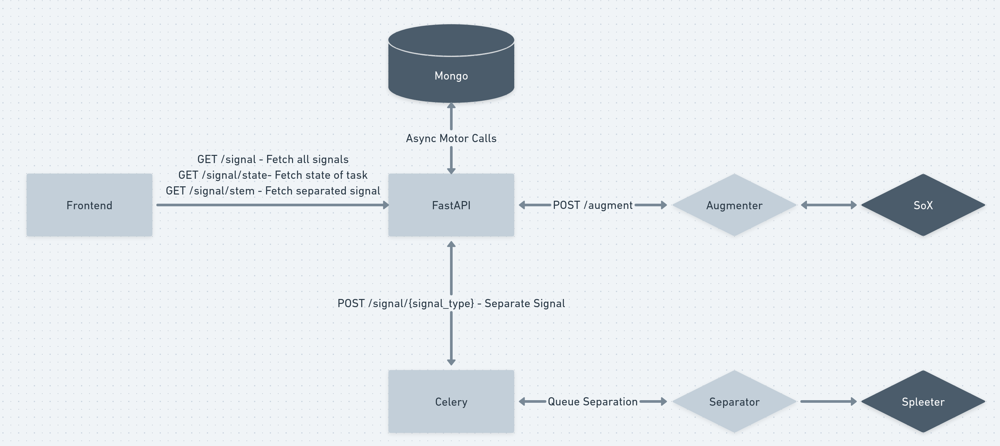

> Related Frontend Project - [Music Recombiner](https://github.com/vitrioil/music-recombiner)

# Signal Separation API
FastAPI based signal separation API for separating music files.

# Working
[FastAPI server](https://github.com/vitrioil/signal_separation/blob/main/api/main.py) takes the request and [Celery server](https://github.com/vitrioil/signal_separation/tree/main/api/worker) performs the signal separation.

Since signal separation is a very GPU intensive task, it is controlled by celery as a background worker to avoid blocking signal separation API call.



[Spleeter](https://github.com/deezer/spleeter) is used for signal separation.
SoX is used for augmentation.

# Running

```bash
poetry install
poetry shell
```

## FastAPI

```bash
./run.sh
```

## Celery

```bash
celery -A task worker --loglevel=INFO # make sure to have api in PYTHONPATH / installed
```

# Separator
Default uses spleeter. 
For custom separator inherit [ABCSeparator](./api/separator/base.py) and use it in [worker](./api/worker/task.py). 

# Augmentations
Default includes volume and reverb augmentation.
More augmentations can be added in [AudioEffectHelper](./api/utils/augment.py)


# Tests
[Automated tests](./api/test/)